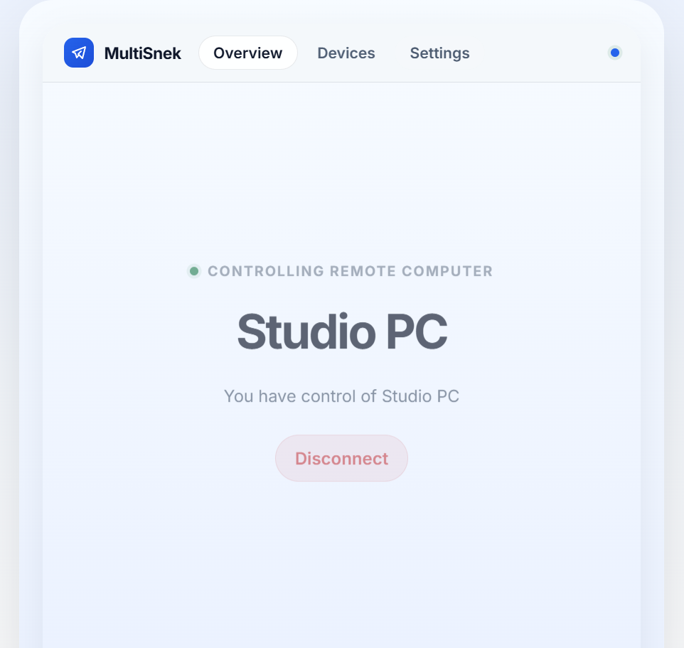
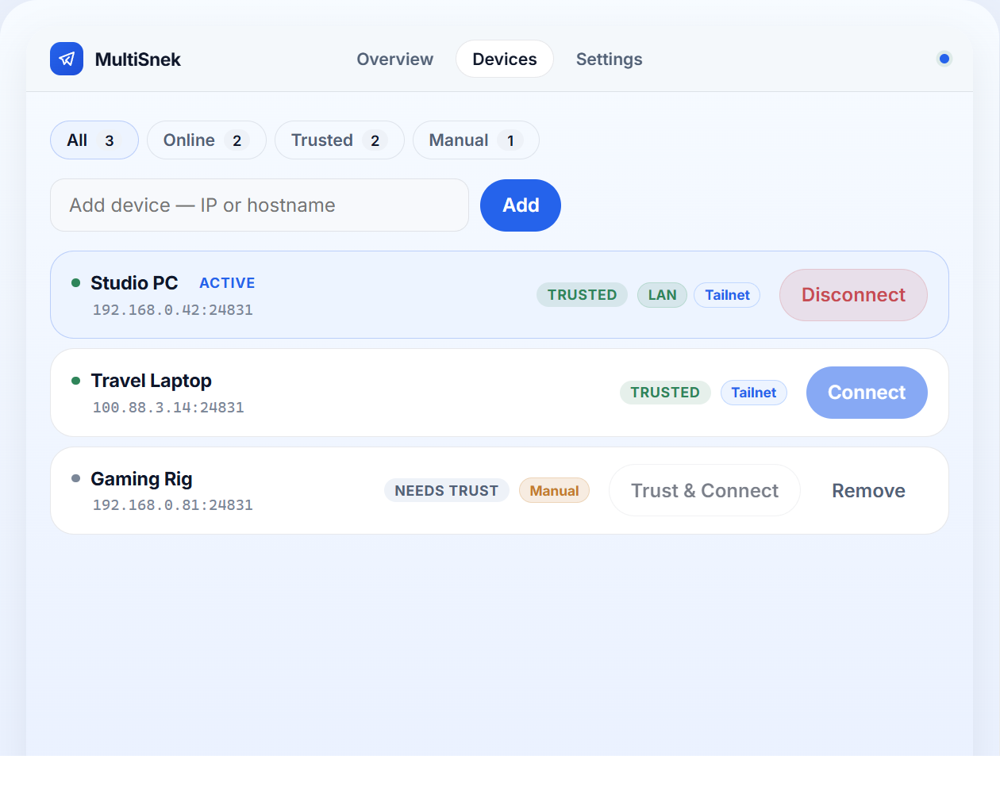
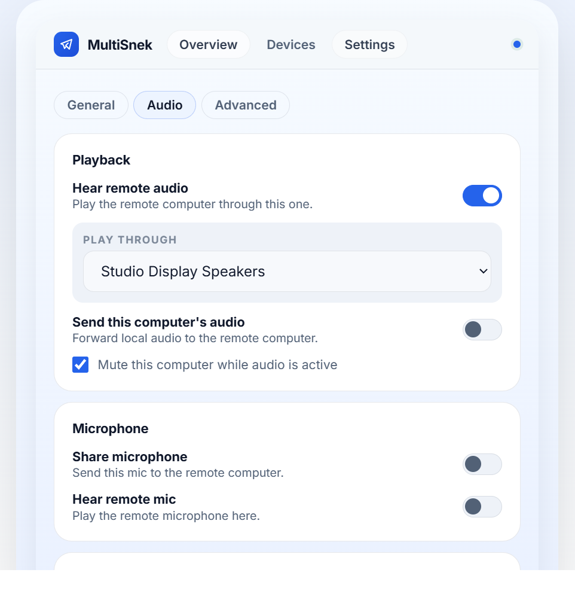

<div align="center">

# 🐍 MultiSnek KVM

**A desktop KVM switch for trusted peers across your LAN and tailnet.**

[](https://go.dev)
[](https://wails.io)
[](https://svelte.dev)
[]()
[](https://github.com/encomjp/MultiSnekKVM/releases/latest)
[](LICENSE)

Move your mouse to the screen edge → cursor jumps to the other PC.  
Keyboard, clipboard, audio, and mic follow seamlessly.

<br>

[](https://github.com/encomjp/MultiSnekKVM/releases/latest)

[View Changelog](CHANGELOG.md) · [Latest Release Notes](https://github.com/encomjp/MultiSnekKVM/releases/latest)

</div>

---

## 🖼️ Screens

<table>
<tr>
<td colspan="2" align="center">

<br>
<strong>Fast handoff between real workstations</strong><br>
<sub>Jump into Studio PC with the live session state front and center instead of buried in a busy control panel.</sub>
</td>
</tr>
<tr>
<td align="center" width="56%">

<br>
<strong>Clear device inventory</strong><br>
<sub>See trusted machines like Studio PC and Travel Laptop alongside manual targets like Gaming Rig before you connect.</sub>
</td>
<td align="center" width="44%">

<br>
<strong>Audio routing built for daily use</strong><br>
<sub>Choose how remote audio lands on this machine without digging through a noisy control panel.</sub>
</td>
</tr>
</table>

---

## 📈 Performance (real measured values)

<table>
<tr>
<td align="center"><strong>~45 MB</strong><br><sub>RAM usage</sub></td>
<td align="center"><strong>~4% CPU</strong><br><sub>avg with active session</sub></td>
<td align="center"><strong>~7 KB/s</strong><br><sub>network w/ audio streaming</sub></td>
<td align="center"><strong>30</strong><br><sub>goroutines</sub></td>
</tr>
</table>

> Measured on Windows 11 with one peer connected and desktop audio streaming active. No Electron, no browser — just a native Go binary with a thin webview.

---

## ✨ Features

| | Feature | Description |
|---|---------|-------------|
| 🖱️ | **Seamless Mouse & Keyboard** | Edge-triggered cursor handoff with configurable four-edge detection |
| 📋 | **Clipboard Sync** | Copy on one PC, paste on the other — instant, bidirectional |
| 🔊 | **Desktop Audio Streaming** | Hear the remote PC's audio or broadcast yours (WASAPI loopback) |
| 🎤 | **Microphone Forwarding** | Send your mic to the remote PC or hear theirs |
| 🔒 | **Trust-on-First-Use Security** | ECDSA P-256 certs, TLS 1.3, fingerprint-pinned peer trust |
| 🌐 | **LAN + Tailscale Discovery** | Auto-discovers peers via UDP broadcast and Tailscale status |
| 🔄 | **Auto-Reconnect** | Exponential backoff reconnection on unexpected disconnect |
| 💓 | **Health Monitor** | Real-time subsystem health checks with frontend status display |
| 📊 | **Latency Display** | Live ping/pong RTT measurement between peers |
| 🛡️ | **Process Watchdog** | Supervisor/child pattern auto-restarts on crash |
| 🧵 | **Goroutine Recovery** | `SafeGoRestart` wraps background goroutines with panic recovery |
| 🖥️ | **System Tray** | Minimize to tray, quick access controls |
| 📂 | **File Transfer** | Send files to the connected peer via the Send Files button |

### ⚠️ Known Issues

| Issue | Status |
|-------|--------|
| **Drag-and-drop across edge** | Disabled — dragging a file to the screen edge does not reliably transfer it to the second monitor due to OLE/multi-monitor conflicts. Use the **Send Files** button instead. In progress. |

## 🚀 Quick Start

### Dev Mode

```powershell
wails dev
```

### Production Build

```powershell
.\build.ps1
```

Output: `build/bin/Multisnek.exe`

> **Note:** `build.ps1` requires [MSYS2 MinGW](https://www.msys2.org/) at `C:\msys64\mingw64\bin` and static Opus/Ogg libraries. CGO is enabled automatically.

## 🔐 Trust Model

| Scenario | Behavior |
|----------|----------|
| **First contact** | Trust-on-first-use pins the peer certificate on the first successful connection in either direction |
| **Known peer** | Future sessions must present the same fingerprint or the connection is rejected |
| **Identity change** | Regenerated certificates or renamed identities require re-trust before traffic is accepted |

Connections still run over TLS 1.3 with device certificates and fingerprint pinning.

## ⚙️ Requirements

- **Windows 10/11** (primary platform)
- **Go 1.25+**
- **Node.js 18+**
- **Wails v2** — `go install github.com/wailsapp/wails/v2/cmd/wails@latest`
- **MSYS2 MinGW** (for production builds with Opus codec)

## 📜 License

See [LICENSE](LICENSE) for details.

